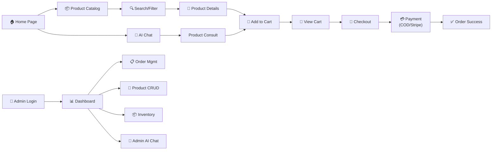
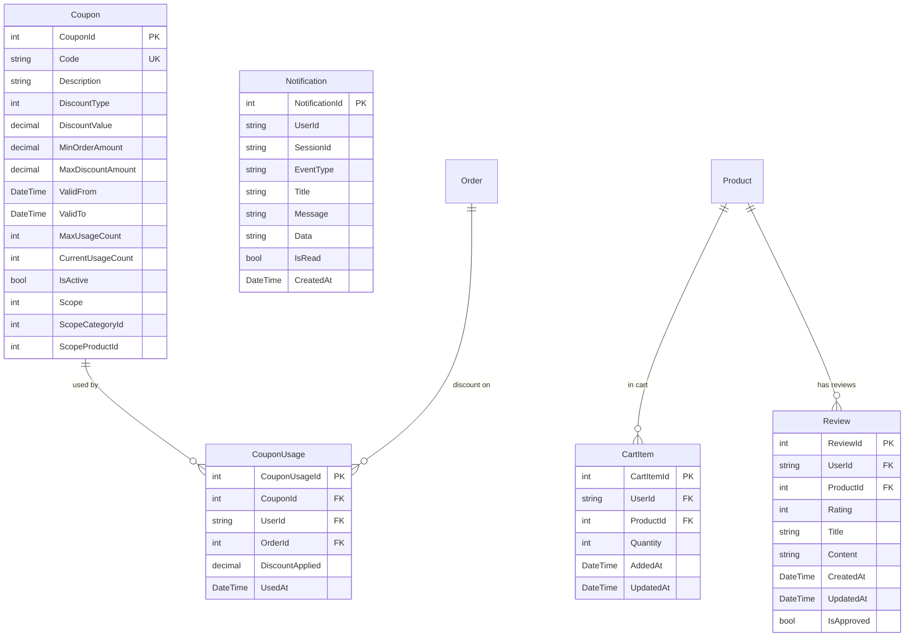
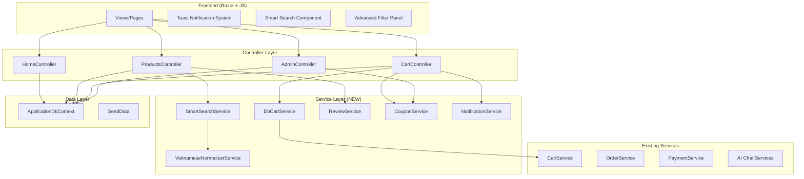

# 🚀 ASOS — SweetCakeShop Full-Cycle Product & Engineering Plan

---

## PHASE 0 — CEO AGENT: PRODUCT STRATEGY REPORT

### 1. Product Identity

**SweetCakeShop** is a Vietnamese e-commerce platform specializing in bakery products (cakes, cookies, bread, mousse, tiramisu). Built on **ASP.NET Core 9 MVC** with **SQL Server**, **ASP.NET Identity** for auth, **Stripe** for payments, and a sophisticated **multi-provider AI chat** system (Gemini + OpenAI) for customer product consultation.

### 2. Current Feature Inventory

| Domain | Status | Details |
|--------|--------|---------|
| **Product Catalog** | ✅ Functional | 21 products across 6 categories, category browsing, product details with similar products |
| **Cart System** | ⚠️ Session-only | In-memory session cart, no DB persistence, lost on session expiry |
| **Checkout & Orders** | ✅ Functional | Guest + authenticated checkout, order tracking, admin order management |
| **Payment** | ✅ Functional | COD + Stripe online payments with fallback bank transfer |
| **Admin Panel** | ✅ Rich | Dashboard, CRUD for products/categories/ingredients, recipe management, order lifecycle, inventory deduction ("MakeCake") |
| **AI Chat (Admin)** | ✅ Advanced | Multi-intent recognition, RAG retrieval, product analytics, revenue analytics, function calling, conversation memory |
| **AI Chat (Customer)** | ✅ Advanced | Product consultation, cart intent, order handoff, multi-provider LLM |
| **Identity & Roles** | ✅ Functional | Admin role seeded, cookie auth with long expiry |
| **Search** | ⚠️ Basic | Simple `Contains()` on product name — no fuzzy, no Vietnamese normalization |
| **Filtering** | ⚠️ Basic | Sort by price (asc/desc), category filter. No price range, no rating filter |
| **Revenue Dashboard** | ✅ Functional | Revenue stats, export to Excel/PDF (ClosedXML + QuestPDF) |
| **Contact Form** | ✅ Functional | Form submission with success feedback |
| **Recipe/Inventory** | ✅ Functional | Full recipe→ingredient→inventory system with auto-deduction |

### 3. User Journey Map

### 4. 🔴 CRITICAL BUSINESS LOGIC GAPS

> [!CAUTION]
> The following features are **MISSING** and represent significant gaps for a production e-commerce platform:

#### GAP 1: Smart Search Engine
- **Current**: Basic `string.Contains()` — fails for Vietnamese diacritics, typos, partial matches
- **Impact**: Users searching "banh kem" won't find "Bánh kem" — direct revenue loss
- **Required**: Vietnamese normalization, fuzzy matching, relevance ranking

#### GAP 2: Advanced Product Filtering
- **Current**: Only price sort + category filter
- **Impact**: Users cannot filter by price range — poor UX for bargain/premium shoppers
- **Required**: Price range slider, combined multi-filter queries (since no rating system exists yet, rating filter will come with GAP 6)

#### GAP 3: Persistent Cart (DB-Backed + Multi-Device Sync)
- **Current**: Session-only cart via `HttpContext.Session` + JSON serialization
- **Impact**: Cart lost on session timeout (2h), cannot sync across devices, no recovery after login
- **Required**: Database-backed cart table, session→DB merge on login, conflict resolution

#### GAP 4: Review & Rating System
- **Current**: Completely absent
- **Impact**: No social proof, no purchase decision assistance, missing key e-commerce feature
- **Required**: 1 user = 1 review/product, average rating calculation, anti-abuse logic

#### GAP 5: Coupon & Promotion Engine
- **Current**: Completely absent
- **Impact**: No promotional capability, no conversion optimization tools
- **Required**: Coupon code system, scoped discounts, time-based rules, validation engine

#### GAP 6: Event-Driven Notification System
- **Current**: Only `TempData` flash messages
- **Impact**: No real-time feedback, no event tracking for analytics
- **Required**: In-app toast notifications for cart events, discount applied, etc.

### 5. Strengths to Preserve
- ✅ Excellent AI chat architecture with clean service separation
- ✅ Robust recipe/inventory management with transactional deduction
- ✅ Well-structured admin panel with comprehensive CRUD operations
- ✅ Clean MVC pattern with proper ViewModels
- ✅ Stripe integration with proper session verification
- ✅ Role-based authorization on admin controllers

---

## PHASE 1 — CTO AGENT: SYSTEM DESIGN DOCUMENT (SDD)

### 1. Technology Stack (Current → Enhanced)

| Layer | Current | Enhancement |
|-------|---------|-------------|
| **Framework** | ASP.NET Core 9 MVC | No change |
| **Database** | SQL Server via EF Core 9 | + New tables for Cart, Review, Coupon |
| **Auth** | ASP.NET Identity | + Enhanced with review ownership validation |
| **Payment** | Stripe Checkout | No change |
| **AI** | Gemini + OpenAI | No change |
| **Search** | LINQ Contains | + Custom Vietnamese normalizer + scoring algorithm |
| **Frontend** | Razor Views + Bootstrap + jQuery | + Enhanced with micro-animations, toast system |
| **Caching** | MemoryCache (registered) | + Used for search results, product ratings |

### 2. New Database Schema

### 3. New API Structure

#### Search API
- `GET /Products/Index?searchTerm=...&sortOrder=...&minPrice=...&maxPrice=...&categoryId=...&minRating=...`

#### Cart API (DB-backed)
- `POST /Cart/Add` — Add/update cart item (session + DB sync)
- `POST /Cart/Update` — Update quantity
- `POST /Cart/Remove` — Remove item
- `GET /Cart/Count` — Get total item count
- `POST /Cart/Merge` — Merge session→DB cart on login (internal)

#### Review API
- `POST /Products/AddReview` — Submit review (auth required, 1 per product)
- `POST /Products/UpdateReview` — Update own review
- `POST /Products/DeleteReview` — Delete own review
- `GET /Products/Reviews/{productId}` — Get paginated reviews

#### Coupon API
- `POST /Cart/ApplyCoupon` — Validate & apply coupon at checkout
- `POST /Cart/RemoveCoupon` — Remove applied coupon
- Admin CRUD: `GET/POST /Admin/Coupons`, `POST /Admin/CreateCoupon`, etc.

#### Notification API
- `GET /api/notifications` — Get unread notifications
- `POST /api/notifications/mark-read` — Mark as read

### 4. Architecture Diagram

---

## PHASE 2 — EXECUTION ROADMAP

### Task Breakdown by Team

---

#### 🔧 Backend Tasks

| # | Task | Priority | Complexity |
|---|------|----------|------------|
| B1 | Create `VietnameseNormalizerService` — diacritics removal, Unicode normalization | 🔴 HIGH | Medium |
| B2 | Create `SmartSearchService` — fuzzy matching with scoring algorithm | 🔴 HIGH | High |
| B3 | Enhance `ProductsController.Index` — price range filter, multi-filter support | 🔴 HIGH | Medium |
| B4 | Create `CartItem` model + DB migration | 🔴 HIGH | Low |
| B5 | Create `DbCartService` — DB-backed cart with session merge logic | 🔴 HIGH | High |
| B6 | Refactor `CartController` — integrate DB cart, session↔DB sync | 🔴 HIGH | Medium |
| B7 | Create `Review` model + DB migration | 🟡 MED | Low |
| B8 | Create `ReviewService` — CRUD, validation, average calculation | 🟡 MED | Medium |
| B9 | Add review endpoints to `ProductsController` | 🟡 MED | Medium |
| B10 | Create `Coupon`, `CouponUsage` models + DB migration | 🟡 MED | Low |
| B11 | Create `CouponService` — validation engine, scope checking, time rules | 🟡 MED | High |
| B12 | Add coupon endpoints to `CartController` | 🟡 MED | Medium |
| B13 | Create `Notification` model + `NotificationService` | 🟢 LOW | Medium |
| B14 | Add notification API endpoints | 🟢 LOW | Low |
| B15 | Admin CRUD for coupons | 🟡 MED | Medium |

---

#### 🎨 Frontend Tasks

| # | Task | Priority | Complexity |
|---|------|----------|------------|
| F1 | Build smart search bar with autocomplete + debounce | 🔴 HIGH | Medium |
| F2 | Build advanced filter panel (price range slider, rating stars) | 🔴 HIGH | Medium |
| F3 | Update product details view with review section | 🟡 MED | Medium |
| F4 | Build review submission form with star rating widget | 🟡 MED | Medium |
| F5 | Build coupon input field at checkout | 🟡 MED | Low |
| F6 | Build toast notification system (CSS + JS) | 🟢 LOW | Medium |
| F7 | Admin coupon management views | 🟡 MED | Medium |
| F8 | Cart merge notification on login | 🔴 HIGH | Low |

---

#### 🗄️ Database Tasks

| # | Task | Priority |
|---|------|----------|
| D1 | Migration: Add `CartItem` table | 🔴 HIGH |
| D2 | Migration: Add `Review` table with unique index (UserId, ProductId) | 🟡 MED |
| D3 | Migration: Add `Coupon` + `CouponUsage` tables | 🟡 MED |
| D4 | Migration: Add `Notification` table | 🟢 LOW |
| D5 | Update `Order` model to add `CouponId`, `DiscountAmount` fields | 🟡 MED |

---

#### 🔐 Security Tasks

| # | Task | Priority |
|---|------|----------|
| S1 | Input sanitization on all new endpoints (search, review, coupon) | 🔴 HIGH |
| S2 | Review ownership validation (users can only edit/delete own reviews) | 🟡 MED |
| S3 | Coupon abuse prevention (usage tracking, per-user limits) | 🟡 MED |
| S4 | Rate limiting on search API to prevent scraping | 🟢 LOW |
| S5 | XSS prevention on review content rendering | 🔴 HIGH |
| S6 | Anti-CSRF tokens on all new POST endpoints | 🔴 HIGH |

---

#### 🧪 QA Tasks

| # | Task | Priority |
|---|------|----------|
| Q1 | Test search: empty query, special chars, Vietnamese diacritics, long strings | 🔴 HIGH |
| Q2 | Test cart: session→DB merge, concurrent updates, empty cart operations | 🔴 HIGH |
| Q3 | Test reviews: duplicate review prevention, boundary ratings (0,5,6), empty content | 🟡 MED |
| Q4 | Test coupons: expired, invalid, over-limit, negative discount, scope validation | 🟡 MED |
| Q5 | Test notifications: concurrent reads, mark-read idempotency | 🟢 LOW |

---

## PHASE 3–10 — EXECUTION SEQUENCE

### Execution Order (Dependency-Aware)

```mermaid
gantt
    title SweetCakeShop ASOS Execution Timeline
    dateFormat X
    axisFormat %s
    
    section Phase 3: DB Foundation
    D1 CartItem Migration        :d1, 0, 1
    D2 Review Migration          :d2, 0, 1
    D3 Coupon Migration          :d3, 0, 1
    D4 Notification Migration    :d4, 0, 1
    D5 Order Coupon Fields       :d5, 0, 1
    
    section Phase 4: Backend Services
    B1 Vietnamese Normalizer     :b1, after d1, 2
    B2 Smart Search Service      :b2, after b1, 3
    B4 CartItem Model            :b4, after d1, 1
    B5 DbCartService             :b5, after b4, 3
    B7 Review Model              :b7, after d2, 1
    B8 ReviewService             :b8, after b7, 2
    B10 Coupon Models            :b10, after d3, 1
    B11 CouponService            :b11, after b10, 3
    B13 NotificationService      :b13, after d4, 2
    
    section Phase 4: Controllers
    B3 Enhanced Filters          :b3, after b2, 2
    B6 Cart Refactor             :b6, after b5, 2
    B9 Review Endpoints          :b9, after b8, 2
    B12 Coupon Endpoints         :b12, after b11, 2
    B14 Notification API         :b14, after b13, 1
    B15 Admin Coupons            :b15, after b11, 2
    
    section Phase 4: Frontend
    F1 Smart Search Bar          :f1, after b3, 2
    F2 Advanced Filters          :f2, after b3, 2
    F3 Review Section            :f3, after b9, 2
    F4 Review Form               :f4, after b9, 2
    F5 Coupon Input              :f5, after b12, 1
    F6 Toast System              :f6, after b14, 2
    F7 Admin Coupons View        :f7, after b15, 2
    F8 Cart Merge UI             :f8, after b6, 1
    
    section Phase 5: Security
    S1-S6 All Security Tasks     :s, after f6, 2
    
    section Phase 6: QA
    Q1-Q5 All QA Tests           :q, after s, 3
```

---

## User Review Required

> [!IMPORTANT]
> **Please review and approve the following before I proceed with execution:**

1. **Feature Priority**: I've prioritized Smart Search and DB-backed Cart as highest priority. Do you agree, or should I reorder?

2. **Coupon Scope**: The proposed coupon engine supports:
   - Global discounts (all products)
   - Category-scoped discounts
   - Product-specific discounts
   - Time-based validity
   - Usage limits (global + per-user)
   
   Is this scope sufficient, or do you need additional coupon types (e.g., user-segment targeting, buy-X-get-Y)?

3. **Review Moderation**: Should reviews be auto-approved or require admin moderation before display?

4. **Cart Merge Strategy**: When a user logs in with items in both session cart and DB cart, should we:
   - **(a)** Merge and sum quantities (recommended)
   - **(b)** DB cart takes priority (discard session)
   - **(c)** Session cart takes priority (overwrite DB)

5. **Notification Delivery**: Should notifications be:
   - **(a)** In-app toast only (recommended for this phase)
   - **(b)** In-app toast + email notifications
   - **(c)** Full real-time via SignalR websockets

## Open Questions

> [!WARNING]
> **API Keys exposed in appsettings.json**: The Stripe, Gemini, and OpenAI API keys are committed in plaintext. These should be moved to User Secrets or environment variables before any deployment. Should I address this as part of the security hardening phase?

> [!NOTE]
> The `csharp SweetCakeShop/` directory contains a secondary `CartController` and `PaymentService` that appear to be an alternative/older implementation. Should these be removed/consolidated, or kept as-is?

---

## Verification Plan

### Automated Tests
- Build verification: `dotnet build` must pass with zero errors
- Migration verification: `dotnet ef migrations add` must generate clean migrations
- Runtime verification: Application must start and seed data successfully

### Manual Verification
- Test all 6 new features end-to-end through the browser
- Verify search works with Vietnamese diacritics and typos
- Verify cart persists across browser sessions after login
- Verify coupon validation rejects expired/invalid codes
- Verify review deduplication (1 per user per product)
- Verify admin can manage all new entities
